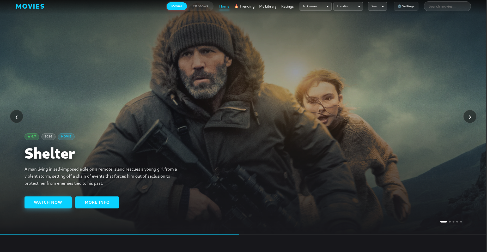
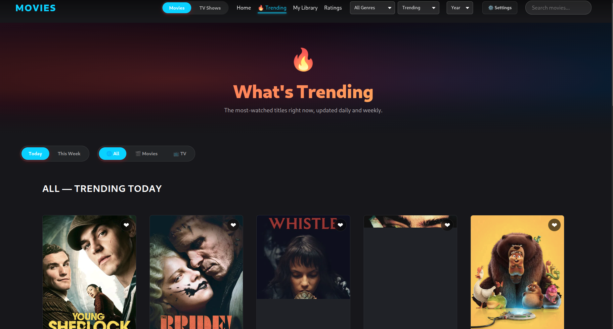
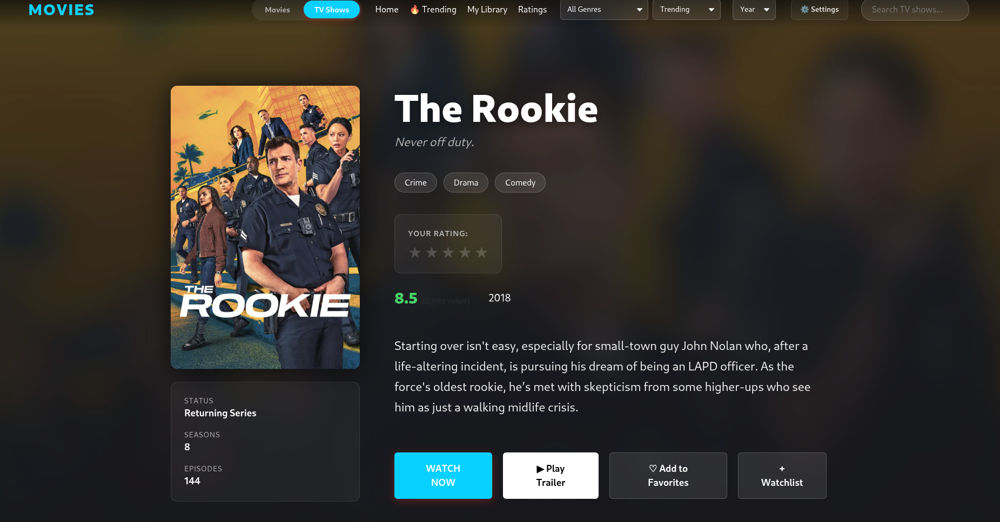
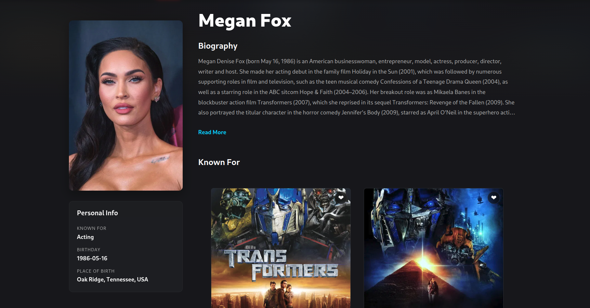
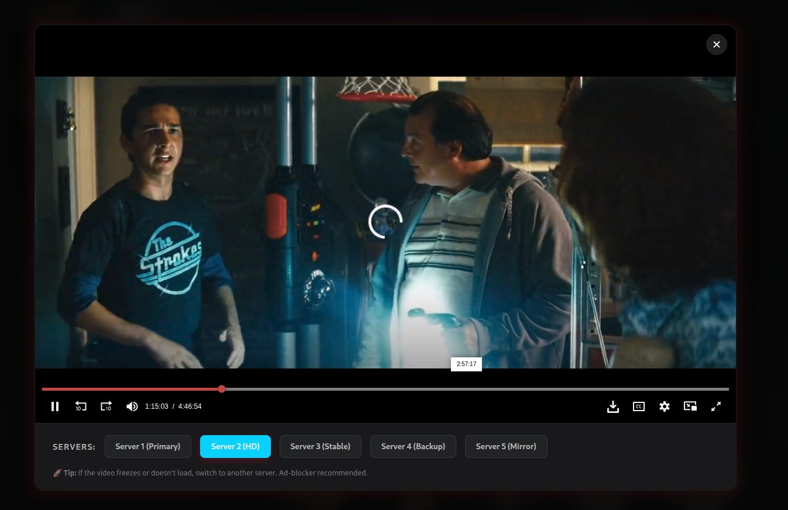
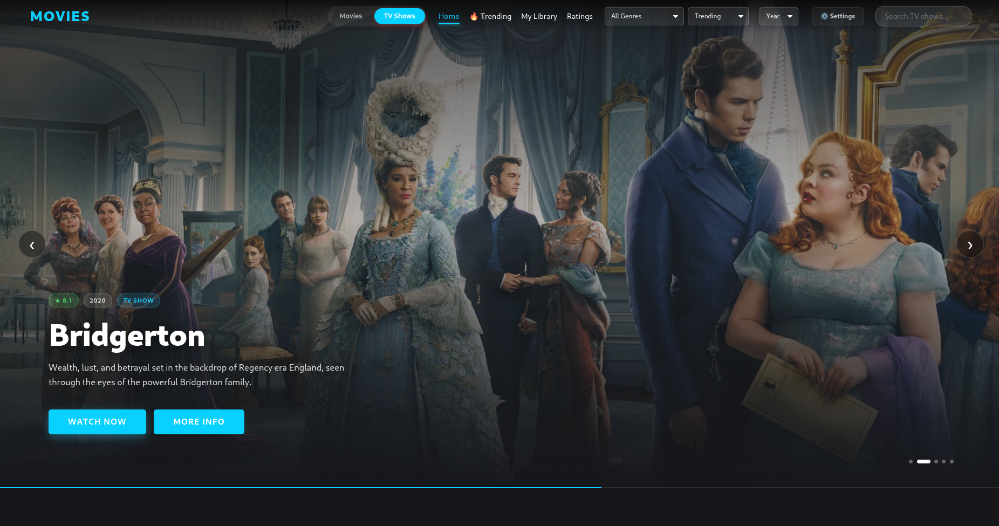

# 🌌 Deshet Stream - Premium Cinematic Platform



**Deshet Stream** is a state-of-the-art movie and TV show discovery platform built for the ultimate cinematic experience. Featuring a futuristic "Deshet Cyan" aesthetic, the platform integrates real-time data from the TMDB API to provide a seamless browsing, tracking, and viewing journey.

---

## ✨ Key Features

### 🚀 Immersive Discovery

- **Dynamic Hero Carousel**: Featured content with cinematic progress bars and instant "Watch Now" integration.
- **Smart Live Search**: Debounced search with real-time suggestions and poster previews.
- **Advanced Filtering**: Filter by genres, release year, and content type (Movie/TV) with professional dropdowns.

### 🕒 Personalized Experience

- **Browsing vs. Watching Logic**: Distinguishes between peeking at details and actively started content.
- **Continue Watching**: A dedicated home-page row for titles you've actually begun watching.
- **Unified Library**: Manage your Watchlist, Favorites, and full Browsing History in one professional dashboard.

### 🎬 Premium Viewing

- **Integrated Streaming Player**: Multi-server support for high-availability playback.
- **Interactive Movie Cards**: Hover previews with cinematic animations and quick-action toolbars.
- **Actor Insights**: Deep-dive into actor biographies and their filmography.

---

## 📸 Screenshots Showcase

### 🏠 Home & Discovery

|           Home Page Hero (Movies)            |                 Trending Section                  |
| :------------------------------------------: | :-----------------------------------------------: |
|  |  |

### 📄 Comprehensive Details

|                 Movie Details Header                  |              Cast & Biography               |
| :---------------------------------------------------: | :-----------------------------------------: |
|  |  |

### Live Player & TV Shows

|                 Integrated Player                 |              TV Show Discovery               |
| :-----------------------------------------------: | :------------------------------------------: |
|  |  |

---

## 🛠️ Tech Stack

- **Frontend**: [React.js](https://reactjs.org/) with [Vite](https://vitejs.dev/)
- **Styling**: Vanilla CSS (Custom tokens & Glassmorphism)
- **State Management**: Context API
- **Navigation**: React Router v6
- **API**: [TMDB (The Movie Database)](https://www.themoviedb.org/documentation/api)

---

## 🚀 Getting Started

### 1. Clone the repository

```bash
git clone https://github.com/Yiheyistm/deshet-stream.git
cd deshet-stream
```

### 2. Install dependencies

```bash
npm install
```

### 3. Setup Environment Variables

Create a `.env` file in the root directory and add your TMDB API Key:

```env
VITE_TMDB_API_KEY=your_api_key_here
```

### 4. Run the development server

```bash
npm run dev
```

---

## 👨‍💻 Developer

**Yiheyis Tamir**
_Flutter Developer | Aspiring Backend Engineer | Tech Enthusiast_

- 🌐 [Portfolio](https://yiheyis-portfolio.vercel.app/)
- 💼 [LinkedIn](https://www.linkedin.com/in/yiheyis-tamir-b56aa8300)
- 🐙 [GitHub](https://github.com/Yiheyistm)

---

## ⚖️ License

This project is licensed under the MIT License - see the [LICENSE](LICENSE) file for details.

_Special thanks to Deshet Tech for the inspiration._
